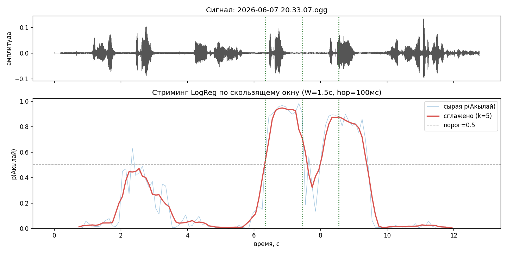

# 🗣️ Akylai KWS — учебный проект по распознаванию ключевого слова

> **Курс:** машинное обучение, тема «Классификация: линейные модели, деревья и ансамбли».
> **Формат:** проект-задание.
> **Что это:** мостик между теорией с лекций и тем, как ML-задачи выглядят в реальном мире.

Вы уже знаете логистическую регрессию, SVM и вот-вот разберёте деревья. Пора применить всё это
не к очередному «Титанику», а к **настоящей инженерной задаче из мира голосовых ассистентов** —
детекции ключевого слова **«Акылай»** в звуке. Здесь есть всё, что делает ML интересным:
дисбаланс классов, признаки, которые нужно понять (а не просто скормить модели), коварные
ошибки, выбор порога и — в финале — **работающее стриминг-приложение**, которое слушает поток
и реагирует на слово.

Это не упражнение «нажми `.fit()` и сдай accuracy». Это маленький исследовательский проект.

---

## Оглавление

1. [Постановка задачи и немного истории](#1-постановка-задачи-и-немного-истории)
2. [Датасет с готовыми признаками](#2-датасет-с-готовыми-признаками)
3. [Задание](#3-задание)
4. [Разведка данных: это вообще моделируется?](#4-разведка-данных-это-вообще-моделируется)
5. [Что уже получилось: демо на простой LogReg](#5-что-уже-получилось-демо-на-простой-logreg)
6. [Код проекта и конфигурация](#6-код-проекта-и-конфигурация)
7. [Приложение: спектральные признаки с формулами](#7-приложение-спектральные-признаки-с-формулами)
8. [Заключение](#8-заключение)

---

## 1. Постановка задачи и немного истории

**Keyword Spotting (KWS)** — это задача обнаружения небольшого набора заранее заданных слов или
коротких фраз в аудиопотоке. Самый знакомый частный случай — **детекция ключевого слова**
(*wake word*, *hotword*): крошечная, постоянно слушающая модель, которая ждёт одну фразу —
*«Окей, Google»*, *«Привет, Siri»*, *«Алиса»* — и только потом будит тяжёлый «большой»
распознаватель речи.

Формально: для аудиосегмента $x$ нужна решающая функция

$$
\hat{y} = \mathbb{1}\!\left[\, p(\text{keyword} \mid x) \ge \tau \,\right],
$$

где $\tau$ — рабочий порог. В нашем проекте ключевое слово — кыргызское имя **«Акылай»**
(три слога, ударение на финальное *-ай*), а задача сведена к самой чистой форме —
**бинарной классификации коротких аудиоклипов**: «Акылай» против «не Акылай».

Почему KWS — отличный учебный пример, лучше «Титаника»:

- **Сильный дисбаланс классов.** В реальности ключевое слово звучит исчезающе редко на фоне
  часов обычной речи. У нас мягкое соотношение **1 : 3** — уже достаточно, чтобы *accuracy
  начала врать*, но ещё не вырожденно.
- **Асимметрия ошибок.** Пропуск слова (*false reject*) раздражает пользователя один раз;
  ложное срабатывание (*false accept*) на звук телевизора — куда хуже. Отсюда весь арсенал
  precision/recall/порога вместо одной цифры.
- **Осмысленный feature engineering.** Звук — не таблица. Превращение волны в вектор признаков
  само по себе является модельным решением.

### Маленькая история wake word

- **1950–60-е — первые распознаватели слов.** *Audrey* от Bell Labs (1952) узнавала произнесённые
  цифры; *Shoebox* от IBM (1962) — 16 слов. Аналоговые «машины сравнения шаблонов», но идея
  сопоставления коротких акустических паттернов родилась именно тогда.
- **1970–80-е — признаки и DTW.** Появляется **кепстр**, а затем **мел-частотные кепстральные
  коэффициенты (MFCC)** (Davis & Mermelstein, 1980) — стандартный фронтенд на десятилетия;
  **Dynamic Time Warping** позволяет сопоставлять слова разной длительности.
- **1980–2000-е — статистические модели.** Доминируют **скрытые марковские модели (HMM)**.
  Классический KWS часто строился как **keyword-filler HMM**: одна модель на ключевое слово,
  «мусорная» модель на всё остальное.
- **2014 — перелом глубокого обучения.** Работа Google *«Small-footprint keyword spotting using
  deep neural networks»* (Chen, Parada & Heigold) показала, что компактная нейросеть на лог-мел
  признаках бьёт HMM — рецепт для *«Окей, Google»* прямо на устройстве.
- **2014–2017 — эпоха умных колонок.** *Amazon Echo / Alexa* (2014), *«Привет, Siri»* на отдельном
  энергоэффективном ядре (2017) сделали постоянно работающую детекцию массовой. Ограничения стали
  жёсткими: **десятки килобайт** параметров, работа в режиме «всегда включено» при милливаттах.
- **2018 — наши дни — свёрточные и стриминговые модели.** Архитектуры вроде **TC-ResNet**,
  **BC-ResNet**, depthwise-separable CNN подняли точность, оставаясь достаточно крошечными для
  микроконтроллера/NPU.

Признаки, с которыми вы будете работать, — это **классический фронтенд** (MFCC и спектральные
дескрипторы). Он исторически точен и идеально перекидывает мостик от «линейных моделей на
таблицах» к «настоящей речи».

---

## 2. Датасет с готовыми признаками

Чтобы вы сразу занялись **моделированием**, а не возились с аудиобиблиотеками, мы уже извлекли
признаки из всех аудиоклипов и выложили готовую таблицу на Hugging Face Hub:

> 📦 **`aiacademy-kg/kws-dataset`** — 40 000 клипов × 250 спектральных признаков + метки.

Каждая строка — один клип, превращённый в **вектор из 250 чисел** (подробно о признаках — в
[разделе 7](#7-приложение-спектральные-признаки-с-формулами)). Классы несбалансированы
**1 : 3** (25 % позитивов).

### Колонки

| Колонка(и) | Тип | Роль |
|---|---|---|
| `mfcc*`, `d1_*`, `d2_*`, `mel*`, `contrast*`, `chroma*`, `centroid_*`, `bandwidth_*`, `rolloff_*`, `flatness_*`, `zcr_*`, `rms_*` | float | **признаки** (250 шт., каждый в вариантах `_mean` и `_std`) |
| `label` | int | **таргет**: `1` = «Акылай», `0` = негатив |
| `source` | str | **метаданные**: `positive` / `base_neg` / `confusable` / `podcast` — *не признак!* |

⚠️ **Колонку `source` нельзя класть в модель.** Она нужна только для **анализа ошибок**: на каком
типе негатива модель спотыкается. (Что это за типы — см. ниже.)

### Загрузка и превращение в pandas

```python
from datasets import load_dataset

# скачиваем готовый датасет с признаками
ds = load_dataset("aiacademy-kg/kws-dataset", split="train")
df = ds.to_pandas()

# X / y — source НЕ кладём в признаки!
X = df.drop(columns=["label", "source"])   # 250 спектральных признаков
y = df["label"]                            # 1 = Акылай, 0 = негатив
groups = df["source"]                      # отложить для анализа ошибок

print(df.shape)             # (40000, 252)
print(y.value_counts())     # 0: 30000, 1: 10000
```

### Откуда родом аудио (важно понимать!)

Негативы неоднородны — это ключ ко всему проекту:

| `source` | метка | сколько | синтетика / живая речь | что это |
|---|:---:|---:|---|---|
| `positive` | **1** | 10 000 | **TTS** (внутренний кыргызский синтез) | слово **«Акылай»**, сгенерированное синтезом речи |
| `base_neg` | 0 | 7 680 | **TTS** (*тот же* движок, что и позитивы) | другие слова/фразы тем же синтетическим голосом |
| `confusable` | 0 | 2 949 | **TTS** (KaniTTS, *другой* движок) | фонетически похожие слова на *-ай / -лай / -кай* |
| `podcast` | 0 | 19 371 | **живая человеческая речь** | 2-секундные нарезки кыргызских подкастов |

Здесь зарыта самая интересная часть задачи (без спойлеров — обнаружите сами в анализе ошибок).

---

## 3. Задание

Ваша цель — пройти **полный цикл ML-исследования** на этих данных: от первой модели до
работающего стриминг-приложения. Сдаётся отчёт (ноутбук) + код приложения.

### Этап 1. Базовая линия и честные метрики
- Постройте тривиальный baseline (`DummyClassifier`). Покажите, **почему accuracy здесь
  обманчива** при дисбалансе 1 : 3.
- Зафиксируйте корректную **схему валидации**: стратифицированное разбиение train/val(/test),
  фиксированный `random_state`. Подумайте о возможной **утечке** (см. подсказку про `source`).

### Этап 2. Линейные модели
- Обучите **несколько линейных моделей**: `LogisticRegression`, `SGDClassifier`,
  `LinearSVC` (а при желании — `SVC` с RBF-ядром).
- Не забудьте про **масштабирование признаков** (`StandardScaler`) — для линейных моделей и SVM
  это обязательно. Объясните в отчёте, **почему**.
- Работайте с дисбалансом: `class_weight="balanced"`, при желании — ресэмплинг.

### Этап 3. Деревья и ансамбли
- Обучите **решающее дерево** и **ансамбли** (`RandomForest`, градиентный бустинг).
- Сравните: нужно ли им масштабирование? Почему деревья к нему инвариантны?
- Изучите **важности признаков** — какие группы признаков работают и почему (свяжите с
  [разделом 7](#7-приложение-спектральные-признаки-с-формулами)).

### Этап 4. Тщательный разбор по метрикам
- Для всех моделей посчитайте **полный пул метрик**: precision, recall, F1, **ROC-AUC**,
  **PR-AUC**, confusion matrix. Постройте **ROC- и PR-кривые**.
- Обоснуйте, какие метрики здесь главные и почему именно PR-AUC информативнее accuracy.

### Этап 5. Анализ ошибок (сердце проекта)
- Используя колонку `source`, посчитайте **отдельно** долю ложных срабатываний на `podcast`,
  `base_neg`, `confusable`. **На каком типе негатива модель ошибается?** Почему именно на нём?
- Сформулируйте, что в этой задаче — *лёгкая* часть, а что — *настоящая* трудность.

### Этап 6. Выбор модели и порога
- Выберите **лучшую линейную** и **лучшую древесную** модель, подберите им **гиперпараметры**
  (`GridSearchCV` / `RandomizedSearchCV` с кросс-валидацией).
- **Подберите рабочий порог** $\tau$: постройте кривые precision/recall/F1 от порога. Помните,
  что в реальном KWS целятся не в F1, а в *recall при заданной частоте ложных тревог*. Опишите
  выбранную рабочую точку и **специфику ошибок** итоговой модели.

### Этап 7. Стриминг-инференс
- Напишите **приложение**, которое принимает аудио произвольной длины (файл или микрофон),
  скользящим окном считает те же признаки и выдаёт поток вероятностей `p(t)`.
- Добавьте **пост-обработку**: сглаживание, порог, подавление повторных срабатываний (debounce).
- Используйте готовый препроцессор [`utils/stream_preprocessor.py`](utils/stream_preprocessor.py)
  и подключите к нему вашу обученную модель/`Pipeline`.

> **Что оценивается:** не максимальная accuracy, а **качество рассуждений** — корректность
> валидации, осмысленность метрик, глубина анализа ошибок и работоспособность стриминга.

---

## 4. Разведка данных: это вообще моделируется?

Прежде чем задавать задание, мы сами прогнали разведочный эксперимент — чтобы убедиться, что
задача честная: не слишком простая и не безнадёжная. Вот пара графиков (**без спойлеров** —
главные выводы вы сделаете сами).

**Баланс классов и состав источников.** Видно тот самый дисбаланс 1 : 3 и то, что негативы
состоят из четырёх разных «миров»:


**Геометрия задачи (PCA).** Если спроецировать 250-мерные признаки на две главные компоненты,
классы **сильно перекрываются** — глазами границу не провести:


Не пугайтесь этой «каши»: то, что классы неразделимы на плоскости, **не означает**, что они
неразделимы в 250 измерениях. Наш эксперимент показал, что данные **уверенно моделируются** — и
даже простые линейные модели справляются на удивление хорошо. А вот *где* именно прячется
настоящая трудность и какие признаки решают — это вы откроете сами. 😉

*(Остальные графики — сравнение моделей, кривые, важности признаков, разбор ошибок — мы намеренно
не показываем, чтобы не спойлерить результат.)*

---

## 5. Что уже получилось: демо на простой LogReg

Чтобы вы поверили, что путь реальный, вот результат **обычной логистической регрессии** на этих
признаках, прогнанной по реальной записи скользящим окном. В записи ключевое слово «Акылай»
звучит **дважды**.

<audio controls src="2026-06-07%2020.33.07.ogg"></audio>

*(Если плеер не отображается — откройте файл [`2026-06-07 20.33.07.ogg`](2026-06-07%2020.33.07.ogg) вручную.)*



Красная кривая — вероятность «Акылай», которую модель выдаёт для каждого положения окна.
**Пики реально совпадают с моментами произнесения ключевого слова**, а на остальной речи
вероятность остаётся низкой. И это — всего лишь линейная модель на классических признаках,
обученная на синтетической речи, но сработавшая на **живом голосе**. Представьте, чего добьётесь вы.

---

## 6. Код проекта и конфигурация

```
.
├── Makefile                      # команды проекта (см. ниже)
├── requirements.txt              # точно зафиксированные версии библиотек
├── config.yaml                   # конфиг извлечения признаков (драфт)
├── utils/
│   ├── feature_extractor.py      # OOP-фронтенд: аудио → 250 признаков (offline, батч)
│   └── stream_preprocessor.py    # OOP-препроцессор для инференса (файл / микрофон), без модели
└── img/                          # графики разведочного анализа
```

### Команды (Makefile)

| Команда | Что делает |
|---|---|
| `make install` | создаёт виртуальное окружение и ставит зафиксированные зависимости |
| `make login` | авторизация в Hugging Face Hub |
| `make dataset` | извлекает признаки по `config.yaml` (запускает `utils/feature_extractor.py`) |
| `make clean` | чистит кэши |

### Извлечение признаков — конфигурируемо

Извлечение полностью управляется [`config.yaml`](config.yaml): можно прогнать **свой** датасет.
Указываете источник (Hugging Face Hub или локальный), колонку с аудио, какие колонки перенести в
результат, и куда сохранить (локальный parquet или выгрузка на Hub):

```yaml
dataset:
  source: hf                       # "hf" | "local"
  repo_or_path: aiacademy-kg/kws-raw
  audio_col: audio                 # где лежит аудио
  keep_cols: [label, source]       # что перенести в результат как есть
output:
  sink: local                      # "local" | "hf"
  path: features.parquet
```

Код построен на **ООП** и разделён по ответственности:

- **`SpectralFeatureExtractor`** — чистый DSP-фронтенд: один сигнал → один вектор признаков. Без
  всякого ввода-вывода, поэтому **переиспользуется и при обучении, и при инференсе** (это и
  страхует от training/serving skew).
- **`DatasetFeatureExtractor`** — батч-обработчик: грузит датасет, параллельно извлекает признаки,
  переносит метаданные, сохраняет результат.
- **`AudioPreprocessor`** (в `stream_preprocessor.py`) — скользящее окно по файлу или
  микрофонному потоку (`pyaudio`). **Модели внутри нет** — он выдаёт только векторы признаков,
  которые вы подключаете к своему обученному `Pipeline`.

```python
from utils.feature_extractor import SpectralFeatureExtractor, FrontendConfig
from utils.stream_preprocessor import AudioPreprocessor

pre = AudioPreprocessor(SpectralFeatureExtractor(FrontendConfig()),
                        window_sec=1.0, hop_sec=0.1)
timestamps, X = pre.process_file("clip.ogg")        # X: (n_окон, 250)
posteriors = my_fitted_pipeline.predict_proba(X)[:, 1]
```

### Сохранение модели для деплоя (joblib / pickle)

Обученную модель **не нужно переобучать при каждом запуске** — её сериализуют в файл и грузят
готовой. Для `scikit-learn` рекомендуется **`joblib`** (эффективнее с большими numpy-массивами
внутри модели, чем стандартный `pickle`), но подойдёт и `pickle`.

Сохраняйте **весь `Pipeline` целиком** — вместе со `StandardScaler` (и подобранным порогом).
Тогда на инференсе масштабирование применяется ровно тем же, чем при обучении, и не возникает
training/serving skew.

```python
import joblib
from sklearn.pipeline import make_pipeline
from sklearn.preprocessing import StandardScaler
from sklearn.linear_model import LogisticRegression

# --- обучение ---
pipe = make_pipeline(StandardScaler(),
                     LogisticRegression(max_iter=2000, class_weight="balanced"))
pipe.fit(X_train, y_train)

# --- сохранение (рекомендуется joblib) ---
joblib.dump({"pipeline": pipe, "threshold": 0.5}, "akylai_logreg.joblib")
# вариант на pickle:
#   import pickle
#   with open("akylai_logreg.pkl", "wb") as f:
#       pickle.dump({"pipeline": pipe, "threshold": 0.5}, f)
```

Загрузка и использование на деплое — модель готова сразу, обучение не повторяется:

```python
import joblib
from utils.feature_extractor import SpectralFeatureExtractor, FrontendConfig
from utils.stream_preprocessor import AudioPreprocessor

artifact = joblib.load("akylai_logreg.joblib")
pipe, threshold = artifact["pipeline"], artifact["threshold"]

pre = AudioPreprocessor(SpectralFeatureExtractor(FrontendConfig()),
                        window_sec=1.0, hop_sec=0.1)
timestamps, X = pre.process_file("clip.ogg")
posteriors = pipe.predict_proba(X)[:, 1]
detections = timestamps[posteriors >= threshold]
```

> ⚠️ **На что обратить внимание при деплое:**
> - сохраняйте **весь pipeline** (препроцессинг + модель + порог), а не один классификатор;
> - **фиксируйте версии** библиотек (`requirements.txt`) — pickle/joblib не гарантируют
>   совместимость между разными версиями `scikit-learn`/`numpy`;
> - конфиг фронтенда (`FrontendConfig`) на инференсе должен **совпадать** с тем, что
>   использовался при обучении признаков — иначе числа «поедут».

---

## 7. Приложение: спектральные признаки с формулами

Этот раздел — для тех, кто хочет понять, *что* за числа лежат в датасете. Разбираться в домене
аудио необязательно: ниже всё с нуля.

Сырой клип — это последовательность из $16\,000$ отсчётов амплитуды в секунду. Слишком много и
переменной длины, чтобы подавать в классификатор напрямую. Классический речевой фронтенд
превращает его в компактный вектор фиксированной длины в три шага: **нарезка на кадры**,
**время-частотное преобразование** и **извлечение признаков + агрегация по времени**.

### 7.1 Нарезка на кадры и оконное преобразование Фурье (STFT)

Сигнал $x(n)$ режется на перекрывающиеся короткие кадры, чтобы каждый был приблизительно
**стационарным** (речевой тракт меняется медленно, масштаб ~10 мс). У нас

$$
N_{\text{fft}} = 512 \;(\approx 32\,\text{мс}), \qquad H = 160 \;(\approx 10\,\text{мс шаг}),
$$

с **окном Ханна** $w(n) = 0.5\left(1 - \cos\frac{2\pi n}{N-1}\right)$ для подавления спектральных
утечек. Для кадра $m$ и частотного бина $k$:

$$
X(m,k) \;=\; \sum_{n=0}^{N_{\text{fft}}-1} x(n + mH)\, w(n)\, e^{-\,j\,2\pi k n / N_{\text{fft}}}.
$$

Из него — **спектр мощности** $S(m,k) = |X(m,k)|^2$ и амплитудный спектр $|X(m,k)|$. Бин $k$
соответствует частоте $f_k = \frac{k}{N_{\text{fft}}} f_s$, где $f_s = 16\,000$ Гц.

### 7.2 Мел-фильтрбанк и лог-мел энергии

Восприятие высоты человеком примерно логарифмическое — это отражает **мел-шкала**:

$$
\text{mel}(f) = 2595 \,\log_{10}\!\left(1 + \frac{f}{700}\right).
$$

Размещаем $M = 40$ перекрывающихся **треугольных фильтров** $H_j(k)$ равномерно по мел-оси и
пропускаем через них спектр мощности:

$$
E_{\text{mel}}(m,j) \;=\; \sum_{k} H_j(k)\, S(m,k), \qquad j = 1,\dots,40 .
$$

В датасете хранятся **логарифмические (дБ) мел-энергии** $10\log_{10} E_{\text{mel}}(m,j)$
(колонки `mel0…mel39`) — грубая, перцептивно-взвешенная картина спектральной огибающей.

### 7.3 Мел-частотные кепстральные коэффициенты (MFCC)

MFCC декоррелируют лог-мел вектор дискретным косинусным преобразованием (**DCT-II**):

$$
c(m,i) \;=\; \sum_{j=1}^{M} \log E_{\text{mel}}(m,j)\,
\cos\!\left[\frac{\pi i}{M}\left(j - \tfrac{1}{2}\right)\right], \qquad i = 0,\dots,19 .
$$

Берём первые **20** коэффициентов (`mfcc0…mfcc19`). Младшие описывают **гладкую огибающую спектра**
(структуру формант → какой звук произнесён); $c(m,0)$ ∝ общей лог-энергии. MFCC почти
**некоррелированы**, что хорошо подходит линейным моделям.

### 7.4 Дельта ($\Delta$) и дельта-дельта ($\Delta\Delta$)

Один кадр ничего не говорит о **движении**. Дельты приближают производную каждого коэффициента
регрессией по $\pm\Theta$ кадрам:

$$
\Delta c(m,i) \;=\; \frac{\displaystyle\sum_{\theta=1}^{\Theta} \theta\,\bigl[c(m+\theta,i) - c(m-\theta,i)\bigr]}
{\displaystyle 2\sum_{\theta=1}^{\Theta} \theta^{2}} .
$$

$\Delta\Delta$ — дельты от дельт (ускорение). Колонки `d1_*` и `d2_*`. Показывают, **как быстро
меняется спектр** — важно, чтобы отличить короткое динамичное слово от стационарного шума.

### 7.5 Спектральный центроид

«Центр масс» спектра — коррелят воспринимаемой **яркости**:

$$
\text{centroid}(m) \;=\; \frac{\sum_{k} f_k \,|X(m,k)|}{\sum_{k} |X(m,k)|}.
$$

### 7.6 Спектральная ширина (bandwidth)

Разброс энергии вокруг центроида (форма со степенью $p=2$):

$$
\text{bandwidth}(m) \;=\;
\left( \frac{\sum_{k} |X(m,k)|\,\bigl(f_k - \text{centroid}(m)\bigr)^{2}}
{\sum_{k} |X(m,k)|} \right)^{1/2}.
$$

### 7.7 Спектральный спад (roll-off)

Частота $f_R(m)$, ниже которой сосредоточена доля $\rho = 0.85$ всей спектральной энергии:

$$
f_R(m) = \min\Big\{ f_K \;:\; \sum_{k:\,f_k \le f_K} |X(m,k)| \;\ge\; \rho \sum_{k} |X(m,k)| \Big\}.
$$

### 7.8 Спектральная плоскостность (flatness)

Отношение **среднего геометрического** к **среднему арифметическому** спектра мощности — мера
«тональность vs шумность» в $[0,1]$:

$$
\text{flatness}(m) \;=\;
\frac{\exp\!\left(\frac{1}{K}\sum_{k}\ln S(m,k)\right)}{\frac{1}{K}\sum_{k} S(m,k)}.
$$

Около $1$ ⇒ похоже на белый шум (плоский спектр); около $0$ ⇒ тональный/гармонический (как
озвонченная речь).

### 7.9 Спектральный контраст (contrast)

Для каждой из **7 поддиапазонов** $b$ — (логарифмическая) разница между **пиками** и **впадинами**
энергии:

$$
\text{contrast}(m,b) \;=\; \overline{\text{Peak}}_b(m) \;-\; \overline{\text{Valley}}_b(m).
$$

Высокий контраст ⇒ чёткая гармоническая структура (форманты выделяются над уровнем шума).
Колонки `contrast0…contrast6`.

### 7.10 Хрома (chroma)

Проекция спектра на **12 высотных классов** равномерно темперированного строя:

$$
\text{chroma}(m,p) \;=\; \sum_{k\,:\,\text{pitch-class}(f_k)=p} |X(m,k)|, \qquad p = 0,\dots,11 .
$$

Октавно-инвариантное гармоническое содержание. Колонки `chroma0…chroma11`.

### 7.11 Частота переходов через ноль (ZCR)

Дешёвая временная мера: как часто волна меняет знак внутри кадра длины $L$:

$$
\text{ZCR}(m) \;=\; \frac{1}{2L}\sum_{n}\bigl|\operatorname{sgn} x(n) - \operatorname{sgn} x(n-1)\bigr|.
$$

Высокий ZCR ⇒ шумные/фрикативные/глухие звуки; низкий ⇒ озвонченные/низкочастотные.

### 7.12 Среднеквадратичная энергия (RMS)

Громкость кадра:

$$
\text{RMS}(m) \;=\; \sqrt{\frac{1}{L}\sum_{n} x(n)^{2}} .
$$

Отслеживает огибающую речи (начала/концы слогов, паузы).

### 7.13 Агрегация по времени: переменная длина → фиксированный вектор

Все признаки выше дают **по одному значению на кадр**, а число кадров у клипов разное. Линейным
моделям нужен **вектор фиксированной длины**, поэтому каждый покадровый признак $\phi$ сворачивается
по $T$ кадрам в **среднее** и **стандартное отклонение**:

$$
\mu_\phi = \frac{1}{T}\sum_{m=1}^{T} \phi(m), \qquad
\sigma_\phi = \sqrt{\frac{1}{T}\sum_{m=1}^{T}\bigl(\phi(m) - \mu_\phi\bigr)^{2}} .
$$

Так каждая группа даёт **две** колонки на канал (`…_mean`, `…_std`), и **любой клип превращается в
один и тот же 250-мерный вектор** независимо от длины. Подсказка: признаки `…_std` особенно
информативны — они кодируют, *насколько спектр движется во времени*.

> 💡 **Важная деталь.** Длительность клипа **намеренно не включена** в признаки: в исходных данных
> она коррелирует с типом источника, и модель могла бы «жульничать». Агрегация в mean/std делает
> вектор инвариантным к длине.

---

## 8. Заключение

Этот проект **сложнее**, чем подогнать модель под готовую табличку с лекции. Здесь придётся
разобраться, откуда берутся признаки, почему accuracy врёт, где прячется утечка, как читать кривые
и выбирать порог, а потом ещё и собрать работающий стриминг. Это нормально — и это именно тот путь,
который проходит каждый исследователь.

Мы убеждены, что этот путь стоит пройти. Как будущие ML-инженеры и исследователи, вы должны уметь
**не просто нажимать кнопки** — а думать, ставить вопросы к данным, не доверять одной красивой
цифре, проверять гипотезы и понимать, *почему* модель работает (или не работает). Именно в этом —
разница между «обучил классификатор» и «провёл исследование».

Здесь у вас настоящая задача из мира голосовых технологий, честные данные и место для собственных
открытий. Дальше — за вами. Удачи, и пусть ваши пики совпадают с ключевым словом. 🎯

---

<sub>Учебный проект. Позитивы — синтетическая речь, поэтому датасет не годится для бенчмаркинга
продакшен-детектора как есть, но идеален для обучения классификации и инженерии аудиопризнаков.
Лицензия данных: Apache-2.0.</sub>
